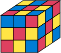

.. include:: ../../README.md
   :parser: myst_parser.sphinx_

Contents
========

.. toctree::
   :maxdepth: 2

   api
   equivalence
   test
   tutorial

Indices and tables
==================

* :ref:`genindex`
* :ref:`modindex`
* :ref:`search`

Appendix
========

.. toctree::
   :maxdepth: 1

   changes
