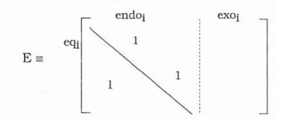
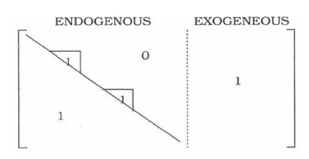
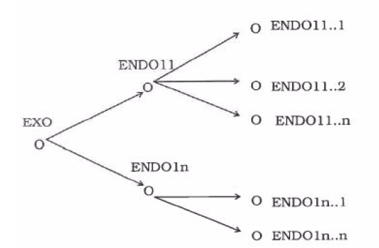

.. _methods_and_algorithms:

Methods And Algorithms
======================

.. _estimation_methods:

ESTIMATION METHODS
------------------

INTRODUCTION
~~~~~~~~~~~~

The estimation methods owe largely to Fair (1984). 
These first two sections are drawn from this book that we highly recommend.
Econometric models are generally nonlinear, simultaneous, and large. 
They also tend to have error terms that are serially correlated. 
The estimation methods of IODE try to handle these characteristics.
The notations that will be used in this chapter are as follows.
Write the model as:

.. math::
   :label: eq_1

    f_i(y_t, x_t, a_i) = u_{it} \quad for \quad i = 1 \dots n \quad and \quad t = 1 \dots T

where

  - :math:`y_t` is an n-dimensional vector of endogenous variables,
  - :math:`x_t` is a vector of predetermined variables,
  - :math:`a_i` is a vector of unknown coefficients,
  - :math:`u_{it}` is an error term.

Assume that the first :math:`m` equations are stochastic, with the remaining 
:math:`u_{it} (i = m+1 \dots n)` identically zero for all :math:`t`.
Let :math:`J_t` be the :math:`n \times n` Jacobian matrix whose :math:`ij` element is 
:math:`f_i/\partial y_{jt} (i, j = 1 \dots n)`. Also, let :math:`u_i` be the T-dimensional 
vector :math:`(u_{i1} \dots u_{iT} , ..., u_{m1} \dots u_{mT})^\prime`.
Let :math:`a` denote the k-dimensional vector :math:`(a_1\prime \dots a_m\prime)` of all the 
unknown coefficients. Finally, let :math:`G_t^\prime` be the :math:`k_i \times T` matrix 
whose column :math:`t` is :math:`\partial f_i(y_t, x_t, a_i)/\partial a_i`, 
where :math:`k_i` is the dimension of :math:`a_i`, and let :math:`G^\prime` be the 
:math:`k \times m.T` matrix,

.. math::

    G^\prime = \begin{bmatrix}
    G_1^\prime & 0          & \dots  & 0 \\
    0          & G_2^\prime & \dots  & 0 \\
    0          & \dots      & \ddots & 0 \\
    0          & \dots      & \dots  & G_m^\prime
    \end{bmatrix}

where :math:`k = \sum^m_{i=1} k_i`.
These vectors and matrices will be used in the following section.

SERIAL CORRELATION AND DYNAMIC ADJUSTMENT MODEL
~~~~~~~~~~~~~~~~~~~~~~~~~~~~~~~~~~~~~~~~~~~~~~~

A convenient way of dealing with serially correlated error terms is to treat the serial 
correlation coefficients as structural coefficients and to transform the equations into 
equations with serially uncorrelated error terms. 
This introduces nonlinear restrictions on the coefficients, but otherwise the equations are 
like any others with serially uncorrelated coefficients.
Consider the ith equation of (:ref:`eq_1`) and assume that uit, is first-order serially 
correlated: 

.. math::
   :label: eq_2

    u_{it} = \rho_i u_{i,t–1} + e_{it} \quad for \quad t = 2 \dots T 

where :math:`e_{it}` is not serially correlated.
Lagging (:ref:`eq_1`) one period, multiplying by :math:`\rho_i`, and subtracting the 
resulting expression from (:ref:`eq_1`) yields:

.. math::
   :label: eq_3

    f_i(y_t, x_t, a_i) - \rho_i f_i(y_{t–1}, x_{t–1}, a_i) = u_{it}  ~ – ~ \rho_i u_{i,t–1} 
    = e_{it} \quad for \quad t = 2 \dots T

The equation includes now :math:`y_{t-1}` and :math:`x_{t-1}` as variables, and 
:math:`\rho_i` as a coefficient, 
but it is no more general than (:ref:`eq_1`), and thus one can deal directly with (:ref:`eq_4`) 
under the assumption that serial correlation has been eliminated through transformation.
The same procedure can handle serial correlation of higher orders.
With respect to testing for serial correlation, it is well known that the Durbin-Watson (DW) 
test is biased toward accepting the null hypothesis of no serial correlation if there is a 
lagged dependent variable in the equation.

ESTIMATION TECHNIQUES
~~~~~~~~~~~~~~~~~~~~~

  - Ordinary Least squares (OLS)
  - Two-Stage Least Squares (2SLS)
  - Three-Stage Least Squores (3SLS)
  - Joint estimation of a non simultaneous system

ORDINARY LEAST SQUARES (OLS)
^^^^^^^^^^^^^^^^^^^^^^^^^^^^

The OLS technique is a special case of the 2SLS technique, where Di in (:ref:`eq_5`) 
and (:ref:`eq_6`) below is the identity matrix. 
It is thus unnecessary to consider this technique separately from the 2SLS technique.

TWO-STAGE LEAST SQUARES (2SLS)
^^^^^^^^^^^^^^^^^^^^^^^^^^^^^^

2SLS estimates of :math:`a_i` (say :math:`\hat{a}_i`) are obtained by minimizing

.. math::
   :label: eq_4

    u_i^\prime Z_i (Z_i^\prime Z_i)^{-1} Z_i^\prime u_i = u_i^\prime D_i^\prime u_i

with respect to :math:`a_i`, where :math:`Z_i` is a :math:`T \times K_i` matrix of 
predetermined variables. :math:`Z_i` and :math:`K_i` can differ from equation to equation. 
An estimation of the covariance matrix of :math:`\hat{a}_i` (say :math:`\hat{V}_{2ii}`) is:

.. math::
   :label: eq_5

    \hat{V}_{2ii} = \hat{\sigma}_{ii} (G_i^\prime D_i G_i)^{-1}

where :math:`\hat{G}_i` is :math:`G_i` evaluated at :math:`\hat{a}_i`, 
:math:`\hat{\sigma}_{ii} = T_i^{-1} \sum_{t=1}^T u_{it} u_{it}`, 
and :math:`u_{it} = f_i(y_{t-1}, x_{t-1}, \hat{a}_i)`.

The 2SLS estimator in this form is presented in Amemiya(L974). 
It handles the case of nonlinearity in both variables and coefficients. 
In earlier work, Kelejian (1971) considered the case of nonlinearity in variables only. 
Bierens (1981,p. 106) has pointed out that Amemiya s proof of consistency of this estimator 
is valid only in the case of linearity in coefficients, that is, only in Kelejian's case. 
Bierens supplies a proof of consistency and asymptotic normality in the general case.

THREE-STAGE LEAST SQUORES (3SLS)
^^^^^^^^^^^^^^^^^^^^^^^^^^^^^^^^

3SLS of :math:`a` (say :math:`\hat{a}`) are obtained by minimizing

.. math::
   :label: eq_6

   u^\prime \hat{S}^{-1} \otimes Z (Z^\prime Z)^{-1} Z^\prime u = u^\prime D u

with respect to :math:`a`, where :math:`\hat{S}` is a consistent estimate of :math:`S` 
and :math:`Z` is a :math:`T \times K` matrix of predetermined variables. 
As estimate of the covarialce matrix of :math:`\hat{a}` (say :math:`\hat{V}_3`) is

.. math::
   :label: eq_7

   \hat{V}_3 = (G^\prime D G)^{-1}

where :math:`\hat{G}` is :math:`G` evaluated at :math:`\hat{a}`. 
:math:`S` is usually estimated from the 2SLS estimated residuals. 
This estimator is presented in Jorgenson and Laffont (1974), and it is further discussed 
in Amemiya(1977). Both prove consistency and asymptotic normality of 3SLS.

JOINT ESTIMATION OF A NON SIMULTANEOUS SYSTEM
^^^^^^^^^^^^^^^^^^^^^^^^^^^^^^^^^^^^^^^^^^^^^

Two aims can lead to jointly estimate several equations : equality restrictions on coefficients 
of different equations, and the presumed existence of contemporaneous correlation of the residuals 
(Seemingly unrelated equations: *SURE*). 
In this case, the joint estimation of the equations increases the efficiency of the estimators.
Algorithmically, the method used is the Zellner method which consists in minimizing a weighted 
sum of the residuals. The weighting matrix is made of the contemporaneous covariance matrix 
of the residuals estimated with the residuals of a first step OLS on the equations. 
The Zellner can then simply be considered as a special case of the 3SLS method where the matrix 
of instruments is an identity matrix. 
The matrix :math:`D` above is identically equal to the matrix :math:`\hat{S}_1 \otimes I`. 

FULL INFORMATION MAXIMUM LIKELIHOOD (FIML)
^^^^^^^^^^^^^^^^^^^^^^^^^^^^^^^^^^^^^^^^^^

Under the assumption that :math:`(u_{1t} \dots u_{mt})` is independently and identically 
distributed as multivariate *N(O,S)*, the density function for one observation is

.. math::
   :label: eq_8

    (2\pi)^{-m/2} |S^*|^{1/2} |J_t| \exp\left(-\frac{1}{2} \sum_{i,j} u_{it} s^*_{ij} u_{jt}\right)

where :math:`S^* = S^{-1}` and :math:`s^*_{ij}` is the :math:`ij` element of :math:`S^*`. 
The Jacobian :math:`J_t` has been defined before.
The likelihood function of t he sample :math:`t = 1 \dots T` is

.. math::
   :label: eq_9

   L^* = (2\pi)^{-m/2} |S^*|^{T/2} \prod_{t=1}^T |J_t| \exp\left(-\frac{1}{2} 
   \sum_{i,j} u_{it} s^*_{ij} u_{jt}\right)

and the log of :math:`L^*` is

.. math::
   :label: eq_10

   \log L^* = -\frac{m}{2} \log 2\pi + \frac{T}{2} \log |S^*| + \sum_{t=1}^T \log |J_t| - 
   \frac{1}{2} \sum_{i,j,t} u_{it} s^*_{ij} u_{jt}

Since log :math:`L^*` is a monotonic function of :math:`L^*`, maximizing :math:`log ~ L^*` 
is equivalent to maximizing :math:`L^*`. The problem of maximizing :math:`log ~ L^*` can be 
broken into two parts: the first is to maximize :math:`log L^*` with respect to the elements 
of :math:`S^*`, and the second is to substitute the resulting expression for :math:`S^*` 
into (:ref:`eq_10`) and to maximize this *concentrated* likelihood function with respect 
to :math:`a`. The derivative of :math:`log ~ L^*` with respect to :math:`s^*_{ij}` is

.. math::
   :label: eq_11

   \frac{\partial \log L^*}{\partial s^*_{ij}} = \frac{T}{2} (s^*_{ij})^{-1} - 
   \frac{1}{2} \sum_{t=1}^T u_{it} u_{jt}

where :math:`s_{ij}` is the :math:`ij` element of :math:`(S^*)^{-1}`. 
This derivative uses the fact that :math:`? = a^*_{ij}` for a matrix :math:`A`. 
Setting (:ref:`eq_11`) equal to zero and solving for :math:`s^*_{ij}` yields

.. math::
   :label: eq_12

    s^*_{ij} = \frac{1}{T} \sum_{t=1}^T u_{it} u_{jt}

since :math:`?` and therefore :math:`?`. 
Substituting (:ref:`eq_12`) into (:ref:`eq_10`) yields

.. math::
   :label: eq_13

   \log L^* = -\frac{m}{2} \log 2\pi + \frac{T}{2} \log |S^*| + \sum_{t=1}^T \log |J_t| - 
   T\frac{m}{2}

The :math:`T\frac{m}{2}` term comes from the fact that 

.. math::

    -\frac{1}{2} \sum_{i,j,t} u_{it} s^*_{ij} u_{jt} = -\frac{1}{2} \sum_{i,j} s^*_{ij} 
    \sum_{t=1}^T u_{it} u_{jt} = \frac{T}{2} \sum_{i,j} s^*_{ij} s^*_{ij} = -\frac{Tm}{2}

The first and last terms on the RHS of (:ref:`eq_13`) are constants, and thus the expression 
to be maximized with respect to a consists of just the middle two terms. 

Since :math:`log|S^*| = log|S^{-1}| = -log|S|`, the function to be maximized can be written

.. math::
   :label: eq_14

   L = -\frac{T}{2} \log |S| + \sum_{t=1}^T \log |J_t|

where, as noted earlier, the :math:`ij` element of :math:`S` is :math:`s_{ij}`.
FIML estimates of a are thus obtained by maximazing :math:`L` with respect to :math:`a`. 
An estimate of the covariance matrix of these estimates (say :math:`\hat{V}_4`) is:

.. math::
   :label: eq_15

   \hat{V}_4 = -\left( \frac{\partial^2 L}{\partial a \partial a^\prime} \right)^{-1}

where the derivatives are evaluated at the optimum.

Phillips (1982) has pointed out that Amemiya's pr oof of consistency and asymptotic efficiency 
(1977) is based on an incorrect lemma. This is corrected in a later paper (Amemiya Ig82). 
Amemiya's article (1977), as corrected, shows that in the nonlinear case FIML is asymptotically 
more efficient than 3SI^S under the assumption of normality. 
In the linear case FIML is consistent even if the error terms are not normally distributed, 
where "FIML" means the full information maximum likelihood estimator derived under the assumption 
of normality. In the nonlinear case this is not in general true, although it sometimes is. 
Phillips (1982) presents an example of a non linear model for which FIML is consistent for a 
wide class of error distributions.

.. _computational_method:

.. _least_squares_techniques:

COMPUTATIONAL METHOD FOR LEAST SQUARES TECHNIQUES
--------------------------------------------------

LINEAR AND NONLINEAR LEAST SQUARES
~~~~~~~~~~~~~~~~~~~~~~~~~~~~~~~~~~

The least squares estimation routine has been de signed to be very general and involve all the 
least squares methods: linear and nonlinear, single or system of equations, uses of instrumental 
variables or not, with or without correction for contemporaneous autocorrelation of residuals. 
The core of the computation is made of an iterative process which will be shown with the help 
of a little example.

Assume that the following equation is to be estimated:

.. math::
   :label: eq_16

   y = f(X, a) + e

where :math:`y` is a :math:`T \times 1` vector of observations of the dependent variable, 
:math:`X` is the :math:`T \times Q` matrix of observations of the independent variables. 
The :math:`Q \times 1` vector a of coefficient are to be estimated. :math:`e` is a 
:math:`T \times 1` vector of residuals, normally distributed with mean :math:`0` and standard 
deviation :math:`s`. It is also assumed that :math:`E(ee^\prime) = s^2 I`, :math:`I` being the 
:math:`T \times T` identity matrix. The function f is not necessarily linear in the variables 
and in the coefficients.The estimator of :math:`a` is the vector :math:`\hat{a}` which minimizes 
the sum of squares of the residuals of the equation (:ref:`eq_16`):

.. math::
   :label: eq_17

    y = f(X, \hat{a}) + e

Let :math:`S=e^\prime e` be the sum of squares of the residuals. 
Equation (:ref:`eq_17`) can be linearized by a Taylor expansion limited to the first term:

.. math::
   :label: eq_18

   y = y_0 + \left. \frac{\partial f}{\partial \hat{a}} \right|_{a = \hat{a}_0} (\hat{a} - \hat{a}_0) + v

where :math:`v=u(\hat{a}_0) + e`, and :math:`u(\hat{a}_0)` represents the terms neglected in the 
Taylor expansion, :math:`\hat{a}_0` is a starting value for :math:`\hat{a}`, and :math:`y_0` 
is defined by :math:`y_0 = f(X, \hat{a}_0)`. 
Equation (:ref:`eq_18`) is linear in :math:`\Delta \hat{a}_1 = (\hat{a} - \hat{a}_0)`.
These parameters can be estimated by OLS, i.e. by

.. math::
   :label: eq_19

   \min S = \min(v^\prime v) = \min \left( (u + e)^\prime (u + e) \right) = 
   u^\prime u + 2u^\prime e + e^\prime e

A new value for the coefficients can then be computed

.. math::
   :label: eq_20

   \hat{a}_1 = \hat{a}_0 + \Delta \hat{a}_1

This operation will be iterated until :math:`\Delta \hat{a}_k`, with :math:`k` the iteration 
number, becomes sufficiently close to zero. At this stage, :math:`\hat{a}_k = \hat{a}`, and 
then :math:`y_k = f(X, \hat{a})`, :math:`u_k = 0` and :math:`S = e^\prime e`.

The iterative process could well not converge, although it can be proved that, if at each 
iteration :math:`\Delta \hat{a}_k` is weighted by :math:`\lambda`, with :math:`|\lambda| < 1`, 
so that :math:`\hat{a}_{k+1} = \hat{a}_k + \lambda \hat{a}_k`, the process must 
converge for sufficiently small values of :math:`\lambda`, provided that there is a minimum.

It is very easy to approximate the derivative of the f function, this is done numerically. 
In the linear case, the approximation is exact and gives the matrix of regressor observations. 
The iterative process reaches a solution within two iterations. 
In the nonlinear case, the matrix of derivatives is no more the matrix of observations, 
and a progressive correction process of the coefficients is repeated until the correction 
to apply is sufficiently small, i.e. smaller than a convergence threshold given by the user. 
At this point, the estimators minimize a weighted sum of the residuals of the equations, 
the :math:`S = S(\hat{a})` function, the complexity of which is determined by the degree of 
non linearity of the system of equations. Nothing guaranties in very special non-linear cases 
that the process will eventually converge, or converge within the maximum number of iterations 
which was given by the user.

A weight (:math:`\lambda` in the foregoing) can be introduced to accelerate convergence for each 
coefficient, these weights are called step relaxation parameters or smoothing parameters, 
by default their values are one, this value can be updated in the equation update screen. 
The step relaxation parameters are important for another reason: if the value of one or more 
relaxation parameters is set to zero, the initial value of the corresponding coefficients will 
be unchanged. This is a way to constraint a coefficient to a predetermined value.

The same iterative procedure is applied for a system of equations, :math:`y_k` and :math:`u_k` 
are no longer vectors of the :math:`T` computed values of the endogenous variable and residuals, 
but are matrices of rank :math:`T` times the number of equations of the system.

.. math::
   :label: eq_21

   G_k = \frac{\partial f(y_t, x_t, a_{k-1})}{\partial a_k}

.. math::
   :label: eq_22

   \Delta \hat{a}_k = (G_k^\prime G_k)^{-1} G_k (y - y_k)

.. math::
   :label: eq_23

   \hat{a}_k = \hat{a}_{k-1} + \lambda \Delta \hat{a}_k

2SLS and 3SLS are incorporated in the procedure by first calculating a weighting matrix 
(a metric) using the specified instrumental variables, and then using this metric in the 
iterative computation of the least squares estimators of :math:`\Delta \hat{a}`. 
In this case, (:ref:`eq_22`) becomes

.. math::
   :label: eq_24

   \Delta \hat{a}_k = (G_k^\prime D_1 G_k)^{-1} G_k D_1 (y - y_k)

with :math:`D_1 = I \otimes Z (Z^\prime Z)^{-1} Z^\prime`.

3SLS and Zellner method require an additional iterative process: the first iterative process 
allows to compute an estimate of the covariance matrix of the contemporaneous residuals, 
the second iterative process re-estimates the coefficients by correcting the metric matrix. 
(:ref:`eq_22`) becomes:

.. math::
   :label: eq_25

   \Delta \hat{a}_k = (G_k^\prime D_2 G_k)^{-1} G_k D_2 (y - y_k)

with :math:`D_2 = S^{-1} \otimes Z (Z^\prime Z)^{-1} Z^\prime` and :math:`S` estimated during 
the first step. The least squares estimation program is very general. 
It can handle linear or nonlinear equations, single equations or a system of equations. 
The estimated coefficients have the *BLUE* properties if the model is linear, but only the 
asymptotic properties are ensured for non-linear models.

The estimated covariance matrix of the coefficients is exact for the linear models, but only 
asymptotically exact for non-linear models.

FIML
~~~~

The algorithm used in IODE to calculate FIML estimates is a Gauss-Newton one. 
Numerical derivatives of the likelihood function are computed like in the least squares algorithm. 
The weighting matrix is the same as in the 3SLS procedure, implying that the user must specify 
a meaningful set of instrumental variables. 
(Moreover, the 3SLS estimates are strongly recommended as starting values.)

.. _standard_statistics:

STANDARD STATISTICS
-------------------

A limited number of statistics are given as standard output by the estimation program.
Per coefficient: the value of the coefficient, the standard error of the coefficient, and 
the t-statistics. In the non-linear case the standard errors of the coefficients only represent 
a lower limit of the true standard errors which will be reached asymptotically.
When the model is a linear single equation with a constant term, the total variance of the 
endogenous variable is equal to the variance explained by the regression plus the residual variance. 
The :math:`R2` statistics represents the explained share of the total variance in percents. 
This statistics is corrected for the number of coefficients. 
Out of this limited case, the interpretation of this statistics is difficult and hazardous.

The standard error gives a more straightforward interpretation of the quality of the adjustment.

.. _simulation_algorithm:

SIMULATION ALGORITHM
--------------------

THE GAUSS-SEIDEL TECHNIQUE
~~~~~~~~~~~~~~~~~~~~~~~~~~ 

Most macro-econometric models are solved using the Gauss-Seidel technique. 
It is a simple technique and in most cases works remarkably well. 
This technique is used in IODE to simulate models. 
The Gauss-Seidel technique is easy to describe by means of an example.

Assume that the model consists of three equations, and let :math:`x_{it}` denote the 
vector of predetermined variables in equation :math:`i`. The model is as follows:

.. math::
   :label: eq_26

   f_1(y_{1t}, y_{2t}, y_{3t}, x_{1t}, a_1) = u_{1t}

.. math::
   :label: eq_27

   f_2(y_{1t}, y_{2t}, y_{3t}, x_{2t}, a_2) = u_{2t}

.. math::
   :label: eq_28

   f_3(y_{1t}, y_{2t}, y_{3t}, x_{3t}, a_3) = u_{3t}

The technique requires that the equations be rewritten with each endogenous variable on the LHS 
of one equation. This is usually quite easy for macro-econometric models, since most equations 
have an obvious LHS variable. 

If, say, the LHS variable for an estimated equation is :math:`ln(y_{2t}/y_{1t})`, then 
:math:`y_{2t}` can be written on the LHS by taking exponents and multiplying the resulting 
expression by :math:`y_{1t}`. 

The program can do that job for you since, for each equation, it requires the definition of the 
endogenous variable specified by the equation, provided that the endogenous variable appears 
only once in the equation. 

The endogenous variable can appear either on the LHS or in the RHS. Simulation of a model requires 
moreover that the endogenous variable be specified only once in the full set of equations.
When these transformations of the equations are done, the model can be rewritten as follows:

.. math::
   :label: eq_29

   y_{1t} = g_1(y_{2t}, y_{3t}, x_{1t}, a_1, u_{1t})

.. math::
   :label: eq_30

   y_{2t} = g_2(y_{1t}, y_{3t}, x_{2t}, a_2, u_{2t})

.. math::
   :label: eq_31

   y_{3t} = g_3(y_{1t}, y_{2t}, x_{3t}, a_3, u_{3t})

In order to solve the model, values of the coefficients and the error terms are needed. 
Given these values and given values of the predetermined variables, the solution proceeds 
as follows. 

Initial values of the endogenous variables are guessed. 
These are either the actual values or extrapolations from the previous period according to 
some rules. IODE allow various strategies. Given these values the equations can be computed 
successively and produce a new set of values for the endogenous variables. 
Given this new set of values, the equations can again be solved to get another set. 
Convergence is reached if for each endogenous variables the values on successive iterations are 
within some prescribed tolerance level.
There is no guarantee that the Gauss-Seidel method will converge. 

The advantage of the technique, however, is that it can usually be made to converge (assuming an 
actual solution exists) with sufficient damping. By damping is meant the following. 
Let :math:`y_{k-1}` denote the solution value of :math:`y` for iteration :math:`k-1` and let 
:math:`\hat{y}_k` denote the value computed by solving the equation on iteration :math:`k`. 
Instead of using :math:`y_k` as the solution value for iteration :math:`k`, one can adjust 
:math:`y_{k-1}` only partway toward :math:`\hat{y}_k`.
If :math:`\lambda` is 1, there is no damping.

.. math::
   :label: eq_32

   y_k = y_{k-1} + \lambda (\hat{y}_k - y_{k-1}) \quad with \quad 0 < \lambda \leq 1

The question of what to use as a stopping rule is not as easy as it might sound. 
The stopping rule can either be in absolute or relative terms. 
In absolute terms it is

.. math::
   :label: eq_33

   |y_{it,k} - y_{it,k-1}| < \epsilon_i

and, in relative, it is

.. math::
   :label: eq_34

   \left| \frac{y_{it,k} - y_{it,k-1}}{y_{it,k-1}} \right| < \epsilon_i

where :math:`\epsilon_i` is the tolerance criterion for variable :math:`i`. 
If damping is used, :math:`y_{it,k}` must be replaced by :math:`\hat{y}`.
A global criterion can also be used

.. math::
   :label: eq_35

   \sqrt{\sum_i (y_{it,k} - y_{it,k-1})^2} < \epsilon_1

The problem is to choose the value for :math:`\epsilon_1`. 
It is inconvenient to have to choose different values of the tolerance criterion for different 
variables, and one would like to use just one value of :math:`\epsilon` throughout. 
This is not, however, a sensible procedure if the units of the variables differ and if the 
absolute criterion is used. The problem is lessened if the percentage criterion is used, but in 
this case one must be concerned with variables that can be close to zero or can be zero.
The solution adopted in IODE is to compute a stopping rule which combines the three 
afore-mentioned criteria

.. math::
   :label: eq_36

   \min \left( \sum_i (y_{it,k} - y_{it,k-1})^2 \right)^{1/2} \max_i 
   \left\{ \min \left( \left| \frac{y_{it,k} - y_{it,k-1}}{y_{it,k-1}} \right| \right) \right\} 
   < \epsilon_1

EQUATION REORDERING
~~~~~~~~~~~~~~~~~~~

To increase the simulation speed, the model can be split into Connex Components. 
Each component will be reorganized by an heuristic algorithm to obtain a quasi sub-diagonal model.

Let E denote the incidence matrix:
   
1. :math:`E_{ij} = 1` if the variable :math:`j` belong to the equation, 0 otherwise

2. After decomposition, the incidence matrix :math:`E` has the following form:

CONNEX COMPONENTS CONSTRUCTION
~~~~~~~~~~~~~~~~~~~~~~~~~~~~~~

Let VARS be the list of endogenous variables

  1. Take the first remaining endogenous variable in VARS : ENDO0
  2. Compute SUCC = list of variables depending on ENDO0 (recursively)
  3. Compute PRE = list of variables from which depends ENDO0 (recursively)
  4. Compute :math:`CFC_i` intersection between SUCC and PRE : new connex component
  5. Let :math:`VARS = VARS \ CFC_i`
  6. If :math:`VARS \neq \varnothing` go to 1, else stop

Reordering of the connex components
^^^^^^^^^^^^^^^^^^^^^^^^^^^^^^^^^^^

Construct the :math:`E^\prime` matrix:

.. math::
   :label: eq_38

   E^\prime_{ij} = 1 \Leftrightarrow \exists k \in CFC_j : E_{kl} = 1, ~ 0 ~ otherwhise
 
To make :math:`E^\prime` lower triangular, apply the following algorithm 
(:math:`O` is the new order of Connex Components):

  1. :math:`O = \{\}`
  2. Choose :math:`i \neq 0` so that :math:`E^\prime_{ij} = 0, \forall j \neq i`
  3. Set :math:`E^\prime_{ij} = 0, \forall j`
  4. Add :math:`i` in :math:`O`
  5. Go to 2 if at least one :math:`CFC` remains

Triangulation of a Connex Component
^^^^^^^^^^^^^^^^^^^^^^^^^^^^^^^^^^^

Each Connex Component (CFC) can be reorganized to minimize the computation time required to 
solve the corresponding system. 
The following algorithm reduces approximately the number of iterations by a factor 2. 
It is based on the fact that to maximize the information during an iteration, the extra-diagonal 
elements of :math:`E` must be as close as possible to the diagonal.

1. compute the sum of extra-diagonal elements:

.. math::

   S1 = \sum_{i} \sum_{j < i} E_{ij}
   S1 = \sum_{i} \sum_{j < i} E_{ij} \cdot (j - i)
   S3 = \max_{j > i} \{ -i : E_{ij} = 1 \}

2.  :math:`\forall i ~ \exists ~ CFC` set equation :math:`i` after equation 
    :math:`k : max_{k>i}, k : E_{ki} = 1`  
3.  Compute :math:`S1^\prime`, :math:`S2^\prime` and :math:`S3^\prime` as :math:`S1`, :math:`S2` 
    and :math:`S3`. 
    If :math:`S1^\prime < S1` and :math:`S2^\prime < S2` and :math:`S3^\prime < S3`, set 
    :math:`S1 = S1^\prime`, :math:`S2 = S2^\prime`, :math:`S3 = S3^\prime` and go to 2 else stop

Goal seeking
^^^^^^^^^^^^

Given :math:`n` pair :math:`ENDO_i-EXO_i` variables, the solution of the system of equations must 
now be computed for the new set of variables consisting of the initial group in which the ENDO 
variables for the given list have been replaced by EXO variables.
If we where to use a NEWTON algorithm or an as simulated method, we would just have to solve 
the system for the new set of variables. 
In the case of the GAUSS algorithm however one must declare a new output variable for each equation.
As an example suppose we do one endo-exo exchange. (for more pai rs we just repeat the process).
The goal is to find a pair of equations, the first of which contains EXO and the endogenous 
variable of the second being ENDO.
We therefore construct a structured tree as below where an arrow indicates that a variable 
belongs to the definition equation of another variable.

